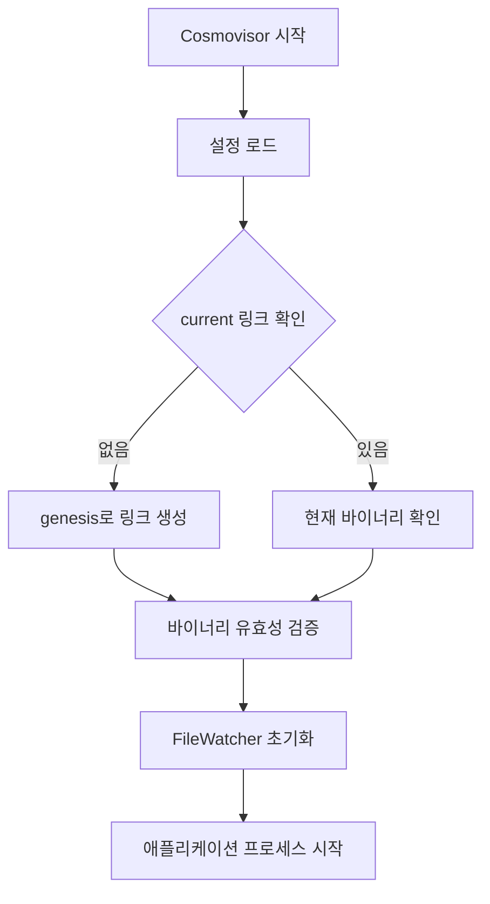
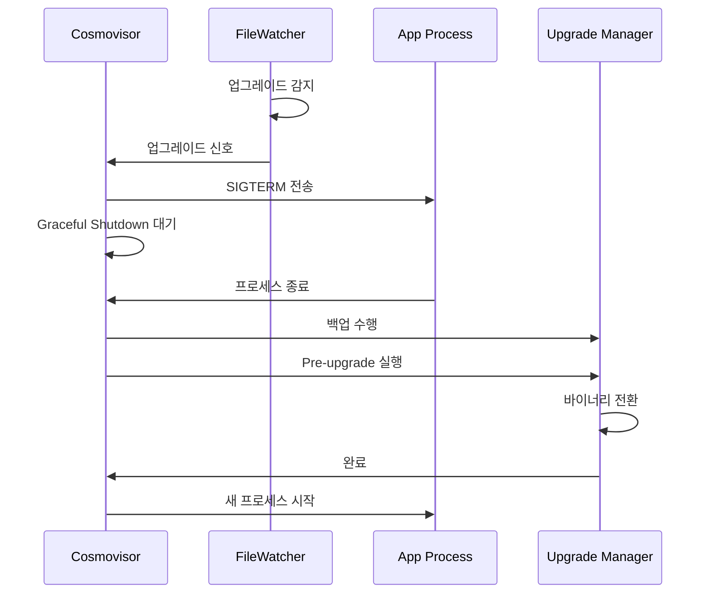

# Cosmovisor 상세 분석 문서

## 목차
1. [개요](#1-개요)
2. [아키텍처](#2-아키텍처)
3. [핵심 구성 요소](#3-핵심-구성-요소)
4. [동작 원리](#4-동작-원리)
5. [주요 기능](#5-주요-기능)
6. [설정 및 환경 변수](#6-설정-및-환경-변수)
7. [Wemix 구현 가이드](#7-wemix-구현-가이드)

---

## 1. 개요

### 1.1 Cosmovisor란?
Cosmovisor는 Cosmos SDK 기반 블록체인 애플리케이션의 바이너리 업그레이드를 자동화하는 프로세스 매니저입니다. 이 도구의 주요 목적은 블록체인 네트워크의 업그레이드 과정에서 노드 운영자의 수동 개입을 최소화하고, 안전하고 일관된 업그레이드 프로세스를 제공하는 것입니다.

### 1.2 주요 특징
- **자동 업그레이드**: 거버넌스 모듈을 통해 승인된 업그레이드를 자동으로 감지하고 실행
- **무중단 전환**: 새로운 바이너리로의 전환을 최소한의 다운타임으로 수행
- **백업 기능**: 업그레이드 전 데이터 자동 백업
- **유연한 설정**: 다양한 환경 변수를 통한 세밀한 제어
- **배치 업그레이드**: 여러 업그레이드를 미리 계획하고 순차적으로 실행

### 1.3 사용 시나리오
- **메인넷 업그레이드**: 실제 운영 중인 블록체인 네트워크의 안전한 업그레이드
- **테스트넷 관리**: 빈번한 업그레이드가 필요한 테스트 환경에서의 자동화
- **개발 환경**: 개발 중인 체인의 지속적인 업데이트 관리

---

## 2. 아키텍처

### 2.1 전체 구조
Cosmovisor는 래퍼(wrapper) 프로세스로서 실제 블록체인 애플리케이션을 자식 프로세스로 실행하고 관리합니다.

```
┌─────────────────────────────────────────────┐
│           Cosmovisor Process                │
│                                             │
│  ┌─────────────────────────────────────┐    │
│  │     Process Launcher (Launcher)     │    │
│  └─────────────────────────────────────┘    │
│                    │                        │
│  ┌─────────────────┴────────────────┐       │
│  │                                  │       │
│  ▼                                  ▼       │
│ ┌──────────────┐          ┌──────────────┐  │
│ │ File Watcher │          │Batch Watcher │  │
│ │              │          │   (gRPC)     │  │
│ └──────────────┘          └──────────────┘  │
│                                             │
│  ┌─────────────────────────────────────┐    │
│  │     Child Process (Blockchain App)  │    │
│  └─────────────────────────────────────┘    │
└─────────────────────────────────────────────┘
```

### 2.2 디렉터리 구조
Cosmovisor는 특정한 디렉터리 구조를 사용하여 바이너리를 관리합니다:

```
$DAEMON_HOME/
├── cosmovisor/
│   ├── current/           # 심볼릭 링크 (현재 활성 바이너리를 가리킴)
│   │   └── bin/
│   │       └── appd       # 실제 실행 바이너리
│   ├── genesis/           # 초기 바이너리 (체인 시작 시 사용)
│   │   └── bin/
│   │       └── appd
│   ├── upgrades/          # 업그레이드 바이너리들
│   │   ├── v2.0.0/
│   │   │   └── bin/
│   │   │       └── appd
│   │   ├── v3.0.0/
│   │   │   └── bin/
│   │   │       └── appd
│   │   └── ...
│   └── config.toml        # Cosmovisor 설정 파일
├── data/
│   ├── upgrade-info.json       # 현재 업그레이드 정보
│   └── upgrade-info.json.batch # 배치 업그레이드 계획
└── backups/               # 데이터 백업 디렉터리
    └── data-backup-2024-1-24/
```

### 2.3 컴포넌트 관계도
```
┌──────────────┐     ┌──────────────┐     ┌──────────────┐
│   Config     │────▶│   Launcher   │────▶│  FileWatcher │
└──────────────┘     └──────────────┘     └──────────────┘
                             │
                             ▼
                     ┌──────────────┐
                     │Process Runner│
                     └──────────────┘
                             │
        ┌────────────────────┼────────────────────┐
        ▼                    ▼                    ▼
┌──────────────┐    ┌───────────────┐    ┌──────────────┐
│Backup Manager│    │Upgrade Manager│    │Signal Handler│
└──────────────┘    └───────────────┘    └──────────────┘
```

---

## 3. 핵심 구성 요소

### 3.1 Config (args.go)
설정 관리를 담당하는 구조체로, 모든 환경 변수와 설정 파일을 파싱합니다.

```go
type Config struct {
    Home                     string        // 홈 디렉터리 경로
    Name                     string        // 바이너리 이름
    AllowDownloadBinaries    bool         // 자동 다운로드 허용 여부
    DownloadMustHaveChecksum bool         // 체크섬 검증 강제
    RestartAfterUpgrade      bool         // 업그레이드 후 자동 재시작
    RestartDelay             time.Duration // 재시작 대기 시간
    ShutdownGrace            time.Duration // Graceful shutdown 시간
    PollInterval             time.Duration // 파일 감시 주기
    UnsafeSkipBackup         bool         // 백업 건너뛰기
    DataBackupPath           string       // 백업 경로
    PreUpgradeMaxRetries     int          // pre-upgrade 최대 재시도
    GRPCAddress              string       // gRPC 서버 주소
    CustomPreUpgrade         string       // 커스텀 pre-upgrade 스크립트
    DisableRecase            bool         // 업그레이드 이름 대소문자 변환 비활성화
}
```

**주요 메서드:**
- `CurrentBin()`: 현재 실행 중인 바이너리 경로 반환
- `UpgradeBin(name)`: 특정 업그레이드의 바이너리 경로 반환
- `SymLinkToGenesis()`: genesis 디렉터리로 심볼릭 링크 생성
- `SetCurrentUpgrade(plan)`: 현재 업그레이드 설정 및 심볼릭 링크 업데이트

### 3.2 Launcher (process.go)
프로세스 실행과 관리를 담당하는 핵심 컴포넌트입니다.

```go
type Launcher struct {
    logger log.Logger
    cfg    *Config
    fw     *fileWatcher
}
```

**주요 메서드:**
- `Run()`: 애플리케이션 프로세스 실행 및 모니터링
- `WaitForUpgradeOrExit()`: 업그레이드 신호 대기 또는 프로세스 종료 대기
- `doBackup()`: 데이터 디렉터리 백업 수행
- `doCustomPreUpgrade()`: 사용자 정의 pre-upgrade 스크립트 실행
- `doPreUpgrade()`: 애플리케이션의 pre-upgrade 명령 실행

### 3.3 FileWatcher (scanner.go)
upgrade-info.json 파일을 모니터링하여 업그레이드를 감지합니다.

```go
type fileWatcher struct {
    daemonHome    string
    filename      string        // upgrade-info.json 전체 경로
    interval      time.Duration // 폴링 주기
    currentBin    string        // 현재 바이너리 경로
    currentInfo   upgradetypes.Plan
    lastModTime   time.Time
    cancel        chan bool
    ticker        *time.Ticker
    needsUpdate   bool
    initialized   bool
    disableRecase bool
}
```

**주요 메서드:**
- `MonitorUpdate()`: 업그레이드 모니터링 시작
- `CheckUpdate()`: 업그레이드 필요 여부 확인
- `checkHeight()`: 현재 블록 높이 확인

### 3.4 BatchUpgradeWatcher (process.go)
배치 업그레이드를 관리하는 기능으로, gRPC를 통해 체인 상태를 실시간 모니터링합니다.

**동작 방식:**
1. upgrade-info.json.batch 파일 로드
2. gRPC를 통해 최신 블록 높이 모니터링
3. 적절한 높이에서 upgrade-info.json 파일 교체
4. 순차적으로 계획된 업그레이드 실행

---

## 4. 동작 원리

### 4.1 초기화 과정


### 4.2 업그레이드 감지 메커니즘

#### 4.2.1 파일 기반 감지 (FileWatcher)
```go
// 주기적으로 upgrade-info.json 파일 확인
func (fw *fileWatcher) CheckUpdate(currentUpgrade upgradetypes.Plan) bool {
    // 1. 파일 존재 여부 확인
    stat, err := os.Stat(fw.filename)
    if err != nil {
        return false
    }

    // 2. 파일 크기 확인 (빈 파일 처리)
    if stat.Size() == 0 {
        // 작성 중일 수 있으므로 잠시 대기
        time.Sleep(2 * time.Millisecond)
        // 재확인...
    }

    // 3. 수정 시간 비교
    if !stat.ModTime().After(fw.lastModTime) {
        return false
    }

    // 4. 파일 내용 파싱
    info, err := parseUpgradeInfoFile(fw.filename)

    // 5. 블록 높이 확인
    currentHeight := fw.checkHeight()
    if currentHeight < info.Height {
        return false  // 아직 업그레이드 높이 도달 안 함
    }

    // 6. 업그레이드 필요 판단
    if info.Height > fw.currentInfo.Height {
        fw.needsUpdate = true
        return true
    }
}
```

#### 4.2.2 배치 업그레이드 (BatchUpgradeWatcher)
```go
func BatchUpgradeWatcher(ctx context.Context, cfg *Config, logger log.Logger) {
    // 1. 배치 파일 로드
    uInfos, err := loadBatchUpgradeFile(cfg)

    // 2. gRPC 연결 설정
    conn, err := grpc.NewClient(cfg.GRPCAddress)
    client := cmtservice.NewServiceClient(conn)

    // 3. 모니터링 루프
    for {
        // 최신 블록 정보 조회
        resp, err := client.GetLatestBlock(ctx)
        h := resp.SdkBlock.Header.Height

        // 다음 업그레이드 높이 확인
        upcomingUpgrade := uInfos[0].Height

        // 적절한 시점에 upgrade-info.json 교체
        if h > prevUpgradeHeight && h < upcomingUpgrade {
            // upgrade-info.json 작성
            json.Marshal(uInfos[0])
            os.WriteFile(cfg.UpgradeInfoFilePath())

            // 배치 리스트 업데이트
            uInfos = uInfos[1:]
        }
    }
}
```

### 4.3 프로세스 재시작 흐름



### 4.4 바이너리 전환 과정

```go
func UpgradeBinary(logger log.Logger, cfg *Config, p upgradetypes.Plan) error {
    // 1. 업그레이드 바이너리 확인
    err := plan.EnsureBinary(cfg.UpgradeBin(p.Name))
    if err == nil {
        // 바이너리가 이미 있으면 링크 변경
        return cfg.SetCurrentUpgrade(p)
    }

    // 2. 자동 다운로드 설정 확인
    if !cfg.AllowDownloadBinaries {
        return fmt.Errorf("binary not present, downloading disabled")
    }

    // 3. 업그레이드 정보에서 URL 추출
    upgradeInfo := plan.ParseInfo(p.Info)
    url := GetBinaryURL(upgradeInfo.Binaries)

    // 4. 바이너리 다운로드
    plan.DownloadUpgrade(cfg.UpgradeDir(p.Name), url)

    // 5. 다운로드된 바이너리 검증
    plan.EnsureBinary(cfg.UpgradeBin(p.Name))

    // 6. 심볼릭 링크 업데이트
    return cfg.SetCurrentUpgrade(p)
}
```

---

## 5. 주요 기능

### 5.1 자동 백업

업그레이드 전 데이터를 자동으로 백업하는 기능입니다.

```go
func (l Launcher) doBackup() error {
    if !l.cfg.UnsafeSkipBackup {
        // 백업 디렉터리 생성 (날짜별)
        st := time.Now()
        ymd := fmt.Sprintf("%d-%d-%d", st.Year(), st.Month(), st.Day())
        dst := filepath.Join(l.cfg.DataBackupPath,
                           fmt.Sprintf("data-backup-%s", ymd))

        // 데이터 디렉터리 복사
        err := copy.Copy(filepath.Join(l.cfg.Home, "data"), dst)

        // 백업 완료 시간 및 소요 시간 로깅
        et := time.Now()
        l.logger.Info("backup completed",
                     "duration", et.Sub(st))
    }
}
```

**백업 특징:**
- 날짜별 디렉터리 생성으로 백업 이력 관리
- 전체 data 디렉터리 복사
- 백업 소요 시간 측정 및 로깅
- `UNSAFE_SKIP_BACKUP=true`로 비활성화 가능

### 5.2 Pre-upgrade 훅

#### 5.2.1 애플리케이션 Pre-upgrade
```go
func (l *Launcher) doPreUpgrade() error {
    counter := 0
    for {
        if counter > l.cfg.PreUpgradeMaxRetries {
            return fmt.Errorf("max retries exceeded")
        }

        // pre-upgrade 명령 실행
        result, err := exec.Command(bin, "pre-upgrade").Output()

        if err != nil {
            exitErr := err.(*exec.ExitError)
            switch exitErr.ExitCode() {
            case 1:  // pre-upgrade 명령이 없음
                return nil
            case 30: // 치명적 오류
                return err
            case 31: // 재시도 가능한 오류
                counter++
                continue
            }
        }

        return nil  // 성공
    }
}
```

**Exit Code 규약:**
- `1`: pre-upgrade 명령 미구현 (정상 진행)
- `30`: 치명적 오류 (업그레이드 중단)
- `31`: 일시적 오류 (재시도)

#### 5.2.2 커스텀 Pre-upgrade 스크립트
```go
func (l Launcher) doCustomPreUpgrade() error {
    if l.cfg.CustomPreUpgrade == "" {
        return nil
    }

    // 스크립트 파일 확인
    preupgradeFile := filepath.Join(l.cfg.Home, "cosmovisor",
                                   l.cfg.CustomPreUpgrade)

    // 실행 권한 설정
    info, _ := os.Stat(preupgradeFile)
    os.Chmod(preupgradeFile, info.Mode().Perm() | 0o100)

    // 스크립트 실행 (업그레이드 이름과 높이 전달)
    cmd := exec.Command(preupgradeFile,
                       upgradePlan.Name,
                       fmt.Sprintf("%d", upgradePlan.Height))
    cmd.Dir = l.cfg.Home
    result, err := cmd.Output()
}
```

### 5.3 자동 다운로드

업그레이드 바이너리를 자동으로 다운로드하는 기능입니다.

```json
// upgrade-info.json 예시
{
    "name": "v2.0.0",
    "height": 1000000,
    "info": {
        "binaries": {
            "linux/amd64": "https://github.com/org/repo/releases/download/v2.0.0/app-linux-amd64?checksum=sha256:abc123...",
            "darwin/arm64": "https://github.com/org/repo/releases/download/v2.0.0/app-darwin-arm64?checksum=sha256:def456...",
            "any": "https://github.com/org/repo/releases/download/v2.0.0/app.zip"
        }
    }
}
```

**다운로드 프로세스:**
1. OS/아키텍처별 URL 선택
2. 바이너리 다운로드
3. 체크섬 검증 (설정된 경우)
4. 실행 권한 설정
5. 바이너리 유효성 확인

### 5.4 Graceful Shutdown

```go
// 프로세스 종료 시 Graceful Shutdown 구현
if l.cfg.ShutdownGrace > 0 {
    // 1. SIGTERM 전송
    cmd.Process.Signal(syscall.SIGTERM)

    // 2. 정상 종료 대기
    select {
    case <-psChan:
        l.logger.Info("app exited normally")
    case <-time.After(l.cfg.ShutdownGrace):
        // 3. 시간 초과 시 강제 종료
        l.logger.Info("grace period exceeded, killing app")
        cmd.Process.Kill()
    }
}
```

### 5.5 신호 처리 (Signal Handling)

```go
// 시스템 신호 처리
sigs := make(chan os.Signal, 1)
signal.Notify(sigs, syscall.SIGQUIT, syscall.SIGTERM)

go func() {
    sig := <-sigs
    cancel()       // 컨텍스트 취소
    wg.Wait()      // 모든 고루틴 종료 대기
    cmd.Process.Signal(sig)  // 자식 프로세스에 신호 전달
}()
```

---

## 6. 설정 및 환경 변수

### 6.1 필수 환경 변수

| 변수명 | 설명 | 예시 |
|--------|------|------|
| `DAEMON_HOME` | 애플리케이션 홈 디렉터리 | `/home/user/.appd` |
| `DAEMON_NAME` | 실행 바이너리 이름 | `appd` |

### 6.2 선택적 환경 변수

| 변수명 | 기본값 | 설명 |
|--------|--------|------|
| `DAEMON_ALLOW_DOWNLOAD_BINARIES` | `false` | 자동 바이너리 다운로드 허용 |
| `DAEMON_DOWNLOAD_MUST_HAVE_CHECKSUM` | `false` | 체크섬 검증 강제 |
| `DAEMON_RESTART_AFTER_UPGRADE` | `true` | 업그레이드 후 자동 재시작 |
| `DAEMON_RESTART_DELAY` | `0s` | 재시작 전 대기 시간 |
| `DAEMON_SHUTDOWN_GRACE` | `0s` | Graceful shutdown 대기 시간 |
| `DAEMON_POLL_INTERVAL` | `300ms` | 파일 감시 주기 |
| `UNSAFE_SKIP_BACKUP` | `false` | 백업 건너뛰기 |
| `DAEMON_DATA_BACKUP_DIR` | `$DAEMON_HOME/backups` | 백업 디렉터리 |
| `DAEMON_PREUPGRADE_MAX_RETRIES` | `0` | pre-upgrade 최대 재시도 횟수 |
| `DAEMON_GRPC_ADDRESS` | `localhost:9090` | gRPC 서버 주소 |
| `COSMOVISOR_DISABLE_LOGS` | `false` | 로그 비활성화 |
| `COSMOVISOR_COLOR_LOGS` | `true` | 컬러 로그 활성화 |
| `COSMOVISOR_TIMEFORMAT_LOGS` | `kitchen` | 로그 시간 형식 |
| `COSMOVISOR_CUSTOM_PREUPGRADE` | `` | 커스텀 pre-upgrade 스크립트 경로 |
| `COSMOVISOR_DISABLE_RECASE` | `false` | 업그레이드 이름 대소문자 변환 비활성화 |

### 6.3 설정 파일 (config.toml)

```toml
# $DAEMON_HOME/cosmovisor/config.toml
daemon_home = "/home/user/.appd"
daemon_name = "appd"
daemon_allow_download_binaries = false
daemon_restart_after_upgrade = true
daemon_poll_interval = "300ms"
daemon_grpc_address = "localhost:9090"
unsafe_skip_backup = false
daemon_data_backup_dir = "/home/user/.appd/backups"
daemon_preupgrade_max_retries = 3
cosmovisor_disable_logs = false
cosmovisor_color_logs = true
```

### 6.4 명령줄 플래그

```bash
# 특정 업그레이드 높이 건너뛰기
cosmovisor run start --unsafe-skip-upgrades 1000000 2000000

# 이 높이들에서는 pre-upgrade 스크립트를 실행하지 않음
```

---

## 7. Wemix 구현 가이드

### 7.1 구현 아키텍처

Wemix용 Cosmovisor 구현 시 고려해야 할 아키텍처입니다:

```
┌─────────────────────────────────────────────────┐
│              Wemix Cosmovisor                   │
│                                                 │
│  ┌──────────────────────────────────────────┐   │
│  │         Core Components                  │   │
│  │  - Process Manager                       │   │
│  │  - Upgrade Monitor                       │   │
│  │  - Binary Manager                        │   │
│  └──────────────────────────────────────────┘   │
│                                                 │
│  ┌──────────────────────────────────────────┐   │
│  │         WBFT Integration                 │   │
│  │  - Consensus State Monitor               │   │ 
│  │  - Validator Set Handler                 │   │
│  │  - Network Coordination                  │   │
│  └──────────────────────────────────────────┘   │
│                                                 │
│  ┌──────────────────────────────────────────┐   │
│  │         Wemix Specific Features          │   │
│  │  - Custom Upgrade Validation             │   │
│  │  - Network-wide Coordination             │   │
│  │  - Rollback Support                      │   │
│  └──────────────────────────────────────────┘   │
└─────────────────────────────────────────────────┘
```

### 7.2 핵심 구현 단계

#### 단계 1: 기본 프로세스 관리
```go
// process_manager.go
type WemixProcessManager struct {
    config   *Config
    process  *os.Process
    logger   log.Logger
    upgradeChan chan UpgradeInfo
}

func (pm *WemixProcessManager) Start() error {
    // 1. 현재 바이너리 경로 확인
    binPath := pm.config.CurrentBin()

    // 2. 프로세스 시작
    cmd := exec.Command(binPath, pm.config.Args...)
    cmd.Stdout = os.Stdout
    cmd.Stderr = os.Stderr

    if err := cmd.Start(); err != nil {
        return fmt.Errorf("failed to start process: %w", err)
    }

    pm.process = cmd.Process

    // 3. 업그레이드 모니터링 시작
    go pm.monitorUpgrade()

    // 4. 프로세스 종료 대기
    return cmd.Wait()
}

func (pm *WemixProcessManager) Stop() error {
    // Graceful shutdown 구현
    if pm.config.ShutdownGrace > 0 {
        pm.process.Signal(syscall.SIGTERM)

        done := make(chan struct{})
        go func() {
            pm.process.Wait()
            close(done)
        }()

        select {
        case <-done:
            return nil
        case <-time.After(pm.config.ShutdownGrace):
            return pm.process.Kill()
        }
    }

    return pm.process.Kill()
}
```

#### 단계 2: 업그레이드 모니터링
```go
// upgrade_monitor.go
type WemixUpgradeMonitor struct {
    config      *Config
    fileWatcher *FileWatcher
    rpcClient   *WemixRPCClient
    logger      log.Logger
}

func (um *WemixUpgradeMonitor) Start(ctx context.Context) <-chan UpgradeInfo {
    upgradeChan := make(chan UpgradeInfo)

    // 파일 기반 모니터링
    go um.watchUpgradeFile(ctx, upgradeChan)

    // RPC 기반 모니터링 (선택적)
    if um.config.EnableRPCMonitor {
        go um.watchViaRPC(ctx, upgradeChan)
    }

    return upgradeChan
}

func (um *WemixUpgradeMonitor) watchUpgradeFile(ctx context.Context, ch chan<- UpgradeInfo) {
    ticker := time.NewTicker(um.config.PollInterval)
    defer ticker.Stop()

    var lastModTime time.Time

    for {
        select {
        case <-ctx.Done():
            return
        case <-ticker.C:
            info, modTime, err := um.checkUpgradeFile()
            if err != nil {
                um.logger.Error("failed to check upgrade file", "error", err)
                continue
            }

            if modTime.After(lastModTime) && um.validateUpgrade(info) {
                ch <- info
                lastModTime = modTime
            }
        }
    }
}

func (um *WemixUpgradeMonitor) validateUpgrade(info UpgradeInfo) bool {
    // 1. 높이 확인
    currentHeight, err := um.rpcClient.GetBlockHeight()
    if err != nil || currentHeight < info.Height {
        return false
    }

    // 2. WBFT 상태 확인
    if !um.checkWBFTConsensus() {
        um.logger.Warn("WBFT consensus not ready for upgrade")
        return false
    }

    // 3. 검증자 집합 확인 (선택적)
    if um.config.ValidatorMode {
        return um.checkValidatorReady()
    }

    return true
}
```

#### 단계 3: 바이너리 관리
```go
// binary_manager.go
type WemixBinaryManager struct {
    config   *Config
    logger   log.Logger
    verifier *BinaryVerifier
}

func (bm *WemixBinaryManager) PrepareUpgrade(info UpgradeInfo) error {
    upgradePath := bm.config.UpgradeDir(info.Name)

    // 1. 바이너리 존재 확인
    if bm.binaryExists(upgradePath) {
        return bm.verifyBinary(upgradePath, info)
    }

    // 2. 자동 다운로드 (설정된 경우)
    if bm.config.AllowDownloadBinaries {
        if err := bm.downloadBinary(info); err != nil {
            return fmt.Errorf("failed to download binary: %w", err)
        }
    } else {
        return fmt.Errorf("binary not found and auto-download disabled")
    }

    // 3. 바이너리 검증
    return bm.verifyBinary(upgradePath, info)
}

func (bm *WemixBinaryManager) SwitchBinary(info UpgradeInfo) error {
    // 1. 백업 수행
    if !bm.config.SkipBackup {
        if err := bm.backupData(); err != nil {
            return fmt.Errorf("backup failed: %w", err)
        }
    }

    // 2. Pre-upgrade 훅 실행
    if err := bm.runPreUpgradeHooks(info); err != nil {
        return fmt.Errorf("pre-upgrade hooks failed: %w", err)
    }

    // 3. 심볼릭 링크 업데이트
    currentLink := filepath.Join(bm.config.Root(), "current")
    newTarget := filepath.Join("upgrades", info.Name)

    // 기존 링크 제거
    os.Remove(currentLink)

    // 새 링크 생성
    if err := os.Symlink(newTarget, currentLink); err != nil {
        return fmt.Errorf("failed to update symlink: %w", err)
    }

    // 4. 업그레이드 정보 저장
    return bm.saveUpgradeInfo(info)
}

func (bm *WemixBinaryManager) verifyBinary(path string, info UpgradeInfo) error {
    // 1. 파일 존재 확인
    binPath := filepath.Join(path, "bin", bm.config.BinaryName)
    if _, err := os.Stat(binPath); err != nil {
        return fmt.Errorf("binary not found: %w", err)
    }

    // 2. 체크섬 검증 (있는 경우)
    if info.Checksum != "" {
        if err := bm.verifier.VerifyChecksum(binPath, info.Checksum); err != nil {
            return fmt.Errorf("checksum verification failed: %w", err)
        }
    }

    // 3. 실행 권한 확인
    if err := bm.verifier.VerifyExecutable(binPath); err != nil {
        return fmt.Errorf("binary not executable: %w", err)
    }

    // 4. Wemix 특화 검증 (버전, 호환성 등)
    if err := bm.verifyWemixCompatibility(binPath); err != nil {
        return fmt.Errorf("compatibility check failed: %w", err)
    }

    return nil
}
```

#### 단계 4: WBFT 통합
```go
// wbft_integration.go
type WBFTIntegration struct {
    config    *Config
    rpcClient *WemixRPCClient
    logger    log.Logger
}

func (wi *WBFTIntegration) CheckConsensusState() error {
    // 1. 현재 합의 상태 확인
    status, err := wi.rpcClient.GetConsensusStatus()
    if err != nil {
        return fmt.Errorf("failed to get consensus status: %w", err)
    }

    // 2. 검증자 집합 동기화 확인
    validators, err := wi.rpcClient.GetValidators()
    if err != nil {
        return fmt.Errorf("failed to get validators: %w", err)
    }

    // 3. 2/3+ 검증자가 준비되었는지 확인
    readyCount := 0
    for _, val := range validators {
        if wi.isValidatorReady(val) {
            readyCount++
        }
    }

    threshold := len(validators) * 2 / 3
    if readyCount < threshold {
        return fmt.Errorf("insufficient validators ready: %d/%d",
                         readyCount, len(validators))
    }

    return nil
}

func (wi *WBFTIntegration) CoordinateUpgrade(info UpgradeInfo) error {
    // 1. 업그레이드 의도 브로드캐스트
    if err := wi.broadcastUpgradeIntent(info); err != nil {
        return err
    }

    // 2. 다른 노드들의 준비 상태 확인
    if err := wi.waitForPeersReady(info); err != nil {
        return err
    }

    // 3. 동기화된 업그레이드 시작
    return wi.initiateCoordinatedUpgrade(info)
}
```

### 7.3 구현 우선순위

#### Phase 1: MVP (최소 기능 제품)
1. **기본 프로세스 관리**
   - 프로세스 시작/중지
   - 신호 처리
   - 로깅

2. **파일 기반 업그레이드 감지**
   - upgrade-info.json 모니터링
   - 높이 확인
   - 기본 검증

3. **심볼릭 링크 관리**
   - current 링크 생성/업데이트
   - 바이너리 경로 해석

#### Phase 2: 핵심 기능
1. **백업 기능**
   - 데이터 디렉터리 백업
   - 백업 이력 관리

2. **Pre-upgrade 훅**
   - 애플리케이션 pre-upgrade 명령
   - 커스텀 스크립트 지원

3. **Graceful Shutdown**
   - 타임아웃 처리
   - 안전한 종료

#### Phase 3: 고급 기능
1. **WBFT 통합**
   - 합의 상태 모니터링
   - 검증자 조율

2. **배치 업그레이드**
   - 다중 업그레이드 계획
   - gRPC/RPC 모니터링

3. **자동 다운로드**
   - 바이너리 다운로드
   - 체크섬 검증
   - 롤백 지원

### 7.4 테스트 전략

#### 단위 테스트
```go
func TestUpgradeDetection(t *testing.T) {
    // 테스트 환경 설정
    tmpDir := t.TempDir()
    config := &Config{
        Home: tmpDir,
        Name: "wemixd",
        PollInterval: 100 * time.Millisecond,
    }

    monitor := NewWemixUpgradeMonitor(config)

    // 업그레이드 파일 생성
    upgradeInfo := UpgradeInfo{
        Name: "v2.0.0",
        Height: 1000,
    }
    writeUpgradeFile(t, tmpDir, upgradeInfo)

    // 업그레이드 감지 확인
    ctx, cancel := context.WithTimeout(context.Background(), 1*time.Second)
    defer cancel()

    upgradeChan := monitor.Start(ctx)

    select {
    case info := <-upgradeChan:
        assert.Equal(t, "v2.0.0", info.Name)
        assert.Equal(t, int64(1000), info.Height)
    case <-ctx.Done():
        t.Fatal("upgrade not detected within timeout")
    }
}
```

#### 통합 테스트
```go
func TestFullUpgradeFlow(t *testing.T) {
    // 1. 테스트 바이너리 준비
    setupTestBinaries(t)

    // 2. Cosmovisor 시작
    cosmovisor := StartTestCosmovisor(t)
    defer cosmovisor.Stop()

    // 3. 업그레이드 트리거
    triggerTestUpgrade(t)

    // 4. 업그레이드 완료 확인
    waitForUpgrade(t, cosmovisor)

    // 5. 새 바이너리 실행 확인
    assertNewBinaryRunning(t, cosmovisor)
}
```

### 7.5 모니터링 및 운영

#### 로깅 전략
```go
// 구조화된 로깅
logger.Info("upgrade detected",
    "name", upgradeInfo.Name,
    "height", upgradeInfo.Height,
    "current_height", currentHeight,
    "action", "preparing_upgrade")

// 에러 로깅
logger.Error("upgrade failed",
    "error", err,
    "phase", "pre_upgrade",
    "retry_count", retryCount)
```

#### 메트릭 수집
```go
type Metrics struct {
    UpgradesTotal      prometheus.Counter
    UpgradesFailed     prometheus.Counter
    UpgradeDuration    prometheus.Histogram
    CurrentVersion     prometheus.Gauge
    BackupSize         prometheus.Gauge
    LastUpgradeTime    prometheus.Gauge
}
```

#### 알림 시스템
```go
type AlertManager struct {
    webhookURL string
    logger     log.Logger
}

func (am *AlertManager) SendUpgradeAlert(info UpgradeInfo, status string) {
    alert := Alert{
        Title:    fmt.Sprintf("Wemix Upgrade: %s", info.Name),
        Status:   status,
        Height:   info.Height,
        Time:     time.Now(),
        NodeID:   am.getNodeID(),
    }

    am.sendWebhook(alert)
}
```

### 7.6 보안 고려사항

1. **바이너리 검증**
   - 체크섬 필수 검증
   - 서명 검증 (GPG)
   - 소스 URL 화이트리스트

2. **권한 관리**
   - 최소 권한 원칙
   - 파일 시스템 권한 확인
   - 프로세스 격리

3. **롤백 메커니즘**
   - 업그레이드 실패 시 자동 롤백
   - 이전 바이너리 보존
   - 데이터 백업 복원

4. **네트워크 보안**
   - TLS 통신
   - 인증된 RPC 연결
   - DDoS 방어

### 7.7 운영 가이드

#### 설치 및 설정
```bash
# 1. Wemix Cosmovisor 설치
git clone https://github.com/wemix/cosmovisor
cd cosmovisor
make install

# 2. 디렉터리 구조 생성
export DAEMON_HOME=$HOME/.wemixd
export DAEMON_NAME=wemixd

mkdir -p $DAEMON_HOME/cosmovisor/genesis/bin
mkdir -p $DAEMON_HOME/cosmovisor/upgrades

# 3. Genesis 바이너리 복사
cp $(which wemixd) $DAEMON_HOME/cosmovisor/genesis/bin/

# 4. 환경 변수 설정
export DAEMON_ALLOW_DOWNLOAD_BINARIES=true
export DAEMON_RESTART_AFTER_UPGRADE=true
export DAEMON_SHUTDOWN_GRACE=30s
export DAEMON_POLL_INTERVAL=300ms

# 5. Cosmovisor 실행
cosmovisor run start
```

#### 업그레이드 준비
```bash
# 1. 업그레이드 바이너리 준비
mkdir -p $DAEMON_HOME/cosmovisor/upgrades/v2.0.0/bin
cp new-wemixd $DAEMON_HOME/cosmovisor/upgrades/v2.0.0/bin/wemixd

# 2. 업그레이드 정보 생성
cat > upgrade-info.json << EOF
{
    "name": "v2.0.0",
    "height": 1000000,
    "info": "Major upgrade with new features"
}
EOF

# 3. 업그레이드 정보 배치 (거버넌스 승인 후)
mv upgrade-info.json $DAEMON_HOME/data/
```

#### 문제 해결
```bash
# 로그 확인
tail -f cosmovisor.log

# 현재 바이너리 확인
readlink $DAEMON_HOME/cosmovisor/current

# 수동 롤백
rm $DAEMON_HOME/cosmovisor/current
ln -s $DAEMON_HOME/cosmovisor/genesis $DAEMON_HOME/cosmovisor/current

# 백업 복원
cp -r $DAEMON_HOME/backups/data-backup-2024-1-24/* $DAEMON_HOME/data/
```

---

## 결론

Cosmovisor는 블록체인 노드의 업그레이드를 자동화하는 강력한 도구입니다.
Wemix 구현 시에는 WBFT 합의 메커니즘의 특성을 고려하고, 네트워크 전체의 조율된 업그레이드를 보장하는 것이 중요합니다.
단계적 구현 접근법을 통해 안정적이고 신뢰할 수 있는 업그레이드 시스템을 구축할 수 있습니다.