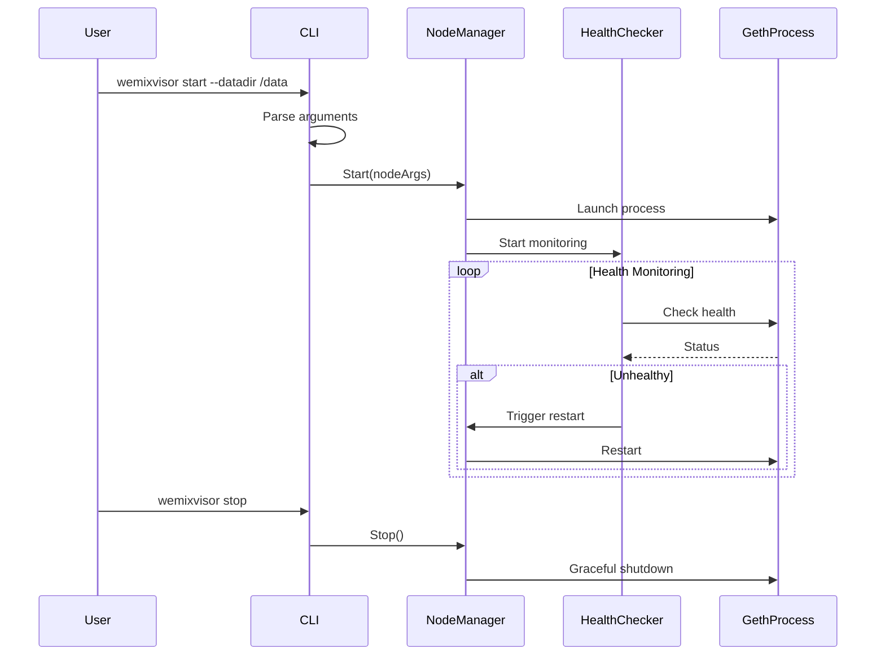

# Phase 4: Node Lifecycle Management Implementation Guide

## Executive Summary

Phase 4 (v0.4.0) transforms wemixvisor into a production-ready node management tool capable of fully managing geth node lifecycles. This phase introduces complete process management, CLI pass-through for geth compatibility, health monitoring, and automated recovery mechanisms.

## Table of Contents

1. [Overview](#1-overview)
2. [Architecture Design](#2-architecture-design)
3. [Implementation Components](#3-implementation-components)
4. [Development Workflow](#4-development-workflow)
5. [Testing Strategy](#5-testing-strategy)
6. [Success Criteria](#6-success-criteria)
7. [Risk Management](#7-risk-management)

---

## 1. Overview

### 1.1 Objectives

**Primary Goals:**
- Complete node lifecycle management (start/stop/restart)
- 100% geth CLI compatibility through pass-through system
- Real-time health monitoring and automated recovery
- Structured logging and status reporting
- 85%+ test coverage

**Business Value:**
- Reduces operational overhead for node operators
- Ensures high availability through automated recovery
- Seamless migration path for existing geth users
- Foundation for future governance and upgrade automation

### 1.2 Scope

**In Scope:**
- Node process management
- CLI argument processing and pass-through
- Health monitoring system
- New CLI commands (start, stop, restart, status, logs)
- Comprehensive testing suite

**Out of Scope:**
- Configuration management (Phase 5)
- Governance integration (Phase 6)
- API server (Phase 7)
- Multi-node management (Future)

### 1.3 Timeline

**Duration:** 4 weeks (28 days)

| Week | Focus Area | Deliverables |
|------|-----------|--------------|
| Week 1 | Enhanced Node Manager | Process control, state management, auto-restart |
| Week 2 | CLI Pass-Through | Argument parsing, validation, geth compatibility |
| Week 3 | Health & Commands | Health monitoring, CLI commands, logging |
| Week 4 | Testing & Documentation | Unit/integration/E2E tests, documentation |

---

## 2. Architecture Design

### 2.1 System Architecture

```
┌─────────────────────────────────────────────────────────────┐
│                     Wemixvisor v0.4.0                       │
├─────────────────────────────────────────────────────────────┤
│                                                             │
│  ┌─────────────┐  ┌──────────────┐  ┌─────────────────┐  │
│  │     CLI     │  │   Commands   │  │    Logging      │  │
│  │  Interface  │──│   Handler    │──│    System       │  │
│  └─────────────┘  └──────────────┘  └─────────────────┘  │
│         │                │                    │            │
│  ┌──────▼────────────────▼────────────────────▼────────┐  │
│  │              Service Orchestrator                    │  │
│  └──────────────────────┬───────────────────────────────┘  │
│                         │                                  │
│  ┌──────────────────────▼───────────────────────────────┐  │
│  │                                                       │  │
│  │  ┌───────────┐  ┌─────────────┐  ┌───────────────┐  │  │
│  │  │   Node    │  │     CLI     │  │    Health     │  │  │
│  │  │  Manager  │  │ Pass-Through│  │   Checker     │  │  │
│  │  └───────────┘  └─────────────┘  └───────────────┘  │  │
│  │                                                       │  │
│  └───────────────────────────────────────────────────────┘  │
│                              │                             │
└──────────────────────────────┼─────────────────────────────┘
                               │
                    ┌──────────▼──────────┐
                    │   Geth Node Process │
                    │  (External Binary)  │
                    └─────────────────────┘
```

### 2.2 Component Interactions



### 2.3 State Machine

```
                   ┌─────────┐
                   │ Stopped │◄──────────────┐
                   └────┬────┘               │
                        │ Start()            │
                   ┌────▼────┐               │
                   │Starting │               │ Stop()
                   └────┬────┘               │
                        │                    │
                   ┌────▼────┐               │
              ┌───►│ Running │───────────────┘
              │    └────┬────┘
              │         │ Crash
              │    ┌────▼────┐
              │    │ Crashed │
              │    └────┬────┘
              │         │ Auto-restart
              └─────────┘
```

---

## 3. Implementation Components

### 3.1 Enhanced Node Manager

#### 3.1.1 Core Responsibilities
- Process lifecycle management
- State tracking and transitions
- Automatic restart on failure
- Graceful shutdown handling
- Environment variable management

#### 3.1.2 Key Features

**Process Management:**
```go
type Manager struct {
    config      *config.Config
    process     *os.Process
    state       NodeState
    restartCount int
    maxRestarts  int

    // Lifecycle channels
    stopCh    chan struct{}
    restartCh chan struct{}
    errorCh   chan error
}
```

**State Management:**
- `StateStopped`: Initial state, no process running
- `StateStarting`: Process is being launched
- `StateRunning`: Process is active and healthy
- `StateStopping`: Graceful shutdown in progress
- `StateUpgrading`: Upgrade in progress (Phase 4 placeholder)
- `StateError`: Error state requiring intervention
- `StateCrashed`: Process crashed unexpectedly

**Auto-Restart Logic:**
```
IF process crashes AND RestartOnFailure == true:
    IF restartCount < maxRestarts:
        Wait 5 seconds
        Increment restartCount
        Restart process
    ELSE:
        Enter Error state
        Alert operator
```

### 3.2 CLI Pass-Through System

#### 3.2.1 Design Principles
- Zero modification to geth arguments
- Clear separation of wemixvisor and geth flags
- Validation without restriction
- Forward compatibility with new geth versions

#### 3.2.2 Argument Processing Flow

```
Input: wemixvisor start --auto-restart --max-restarts 5 -- --datadir /data --networkid 1001

Processing:
1. Split at "--" delimiter
2. Parse wemixvisor flags (before --)
3. Validate wemixvisor configuration
4. Pass geth flags (after --) unchanged
5. Build final command

Output: geth --datadir /data --networkid 1001
```

#### 3.2.3 Known Geth Flags Registry

Categories of geth flags to recognize:
- **Network**: `--networkid`, `--port`, `--bootnodes`, `--maxpeers`
- **API**: `--http`, `--http.port`, `--ws`, `--graphql`
- **Storage**: `--datadir`, `--keystore`, `--cache`
- **Mining**: `--miner.etherbase`, `--miner.gasprice`
- **Performance**: `--cache.database`, `--cache.trie`

### 3.3 Health Monitoring System

#### 3.3.1 Health Check Components

**RPC Health Check:**
- Endpoint: `http://localhost:8545`
- Method: JSON-RPC `eth_syncing`
- Frequency: Every 30 seconds
- Timeout: 5 seconds

**Peer Count Check:**
- Minimum peers: 1 (configurable)
- Method: `net_peerCount`
- Action: Warn if below threshold

**Sync Status Check:**
- Monitor sync progress
- Detect stuck synchronization
- Alert on prolonged syncing

#### 3.3.2 Health Status Response

```json
{
  "healthy": true,
  "timestamp": "2024-09-26T14:30:00Z",
  "checks": {
    "rpc_endpoint": {
      "healthy": true,
      "latency_ms": 12
    },
    "peer_count": {
      "healthy": true,
      "peers": 8,
      "min_required": 1
    },
    "sync_status": {
      "healthy": true,
      "syncing": false,
      "current_block": 1234567,
      "highest_block": 1234567
    }
  }
}
```

### 3.4 New CLI Commands

#### 3.4.1 Command Structure

```bash
wemixvisor
├── start [options] [-- node-options]  # Start node
├── stop                               # Stop node
├── restart                            # Restart node
├── status                             # Show status
├── logs [options]                     # View logs
└── run [args...]                      # Legacy compatibility
```

#### 3.4.2 Command Specifications

**start Command:**
```bash
Usage: wemixvisor start [wemixvisor-options] -- [geth-options]

Wemixvisor Options:
  --config FILE           Config file path
  --auto-restart         Enable auto-restart (default: true)
  --max-restarts N       Max restart attempts (default: 5)
  --health-check-interval  Health check interval (default: 30s)

Examples:
  wemixvisor start -- --datadir /data --http
  wemixvisor start --max-restarts 10 -- --networkid 1001
```

**status Command:**
```bash
Usage: wemixvisor status [--json]

Output:
  State:        running
  PID:          12345
  Uptime:       2h 30m 45s
  Restarts:     0
  Health:       healthy
  Version:      1.0.0
  Network:      mainnet
```

**logs Command:**
```bash
Usage: wemixvisor logs [options]

Options:
  -f, --follow     Follow log output
  -n, --lines N    Show last N lines (default: 100)
  --since TIME     Show logs since timestamp
  --until TIME     Show logs until timestamp
  --grep PATTERN   Filter logs by pattern
```

---

## 4. Development Workflow

### 4.1 Week 1: Enhanced Node Manager

**Day 1-2: Core Structure**
```bash
# Create directory structure
mkdir -p internal/node
touch internal/node/{manager.go,state.go,process.go}

# Implement basic Manager struct and methods
- NewManager()
- Start()
- Stop()
- GetState()
```

**Day 3-4: Process Control**
```bash
# Implement process management
- Launch process with context
- Handle signals (SIGTERM, SIGINT)
- Implement graceful shutdown
- Add timeout mechanisms
```

**Day 5-7: Auto-Restart**
```bash
# Implement monitoring and auto-restart
- Monitor goroutine
- Crash detection
- Restart logic with backoff
- Maximum restart limits
```

### 4.2 Week 2: CLI Pass-Through

**Day 1-2: Argument Parser**
```bash
# Create CLI package
mkdir -p internal/cli
touch internal/cli/{passthrough.go,parser.go,validator.go}

# Implement argument parsing
- Split wemixvisor vs geth args
- Parse flag formats (--key=value, --key value)
- Handle special characters and quotes
```

**Day 3-4: Validation System**
```bash
# Implement validation
- Known flag registry
- Flag compatibility checks
- Value validation
- Error reporting
```

**Day 5-7: Integration**
```bash
# Integrate with Node Manager
- Build command from parsed args
- Environment variable handling
- Working directory setup
- Testing with real geth binary
```

### 4.3 Week 3: Health Monitoring & Commands

**Day 1-2: Health Checker**
```bash
# Create monitoring package
mkdir -p internal/monitor
touch internal/monitor/{health.go,checks.go}

# Implement health checks
- RPC endpoint check
- Peer count check
- Sync status check
- Composite health status
```

**Day 3-5: CLI Commands**
```bash
# Implement new commands
mkdir -p cmd/wemixvisor/commands
touch cmd/wemixvisor/commands/{start.go,stop.go,status.go,logs.go}

# Command implementation
- Command registration with cobra
- Argument handling
- Output formatting (text/json)
```

**Day 6-7: Logging System**
```bash
# Enhance logging
- Structured logging with fields
- Log rotation
- Log streaming for 'logs' command
- Debug vs production modes
```

### 4.4 Week 4: Testing & Documentation

**Day 1-3: Unit Tests**
```bash
# Write comprehensive unit tests
go test ./internal/node -cover
go test ./internal/cli -cover
go test ./internal/monitor -cover

# Target: 85% coverage
```

**Day 4-5: Integration Tests**
```bash
# Create integration tests
mkdir -p test/integration
touch test/integration/lifecycle_test.go

# Test scenarios
- Full lifecycle (start → restart → stop)
- Auto-restart on crash
- Health check triggers
- CLI command integration
```

**Day 6-7: Documentation & Polish**
```bash
# Documentation
- Update README.md
- Create user guide
- API documentation
- Troubleshooting guide

# Final testing and bug fixes
- Performance profiling
- Memory leak detection
- Cross-platform testing
```

---

## 5. Testing Strategy

### 5.1 Test Coverage Goals

| Component | Target Coverage | Priority |
|-----------|----------------|----------|
| Node Manager | 90% | High |
| CLI Pass-Through | 85% | High |
| Health Checker | 85% | Medium |
| CLI Commands | 80% | Medium |
| Overall | 85% | Required |

### 5.2 Unit Test Examples

**Node Manager Tests:**
```go
func TestManager_Lifecycle(t *testing.T)
func TestManager_AutoRestart(t *testing.T)
func TestManager_GracefulShutdown(t *testing.T)
func TestManager_StateTransitions(t *testing.T)
func TestManager_MaxRestartLimit(t *testing.T)
```

**CLI Pass-Through Tests:**
```go
func TestPassThrough_ParseArgs(t *testing.T)
func TestPassThrough_SeparateFlags(t *testing.T)
func TestPassThrough_ValidateGethFlags(t *testing.T)
func TestPassThrough_BuildCommand(t *testing.T)
```

**Health Checker Tests:**
```go
func TestHealthChecker_RPCCheck(t *testing.T)
func TestHealthChecker_PeerCountCheck(t *testing.T)
func TestHealthChecker_SyncStatusCheck(t *testing.T)
func TestHealthChecker_CompositeHealth(t *testing.T)
```

### 5.3 Integration Test Scenarios

**Scenario 1: Normal Operation**
```
1. Start wemixvisor with geth
2. Verify process is running
3. Check health status
4. Perform graceful restart
5. Verify continuity
6. Stop gracefully
```

**Scenario 2: Crash Recovery**
```
1. Start wemixvisor with crash-prone binary
2. Wait for crash
3. Verify auto-restart triggered
4. Check restart count
5. Verify health restored
```

**Scenario 3: CLI Compatibility**
```
1. Start with complex geth arguments
2. Verify all arguments passed correctly
3. Check geth is configured properly
4. Restart with different arguments
5. Verify configuration changes applied
```

### 5.4 E2E Test Setup

**Test Environment:**
```yaml
test_environment:
  geth_binary: mock/real geth binary
  network: private testnet
  datadir: temporary directory
  ports:
    p2p: 30303
    rpc: 8545
    ws: 8546
```

**Performance Benchmarks:**
```go
func BenchmarkNodeStart(b *testing.B)
func BenchmarkHealthCheck(b *testing.B)
func BenchmarkArgParsing(b *testing.B)
func BenchmarkLogStreaming(b *testing.B)
```

---

## 6. Success Criteria

### 6.1 Functional Requirements

| Requirement | Acceptance Criteria | Status |
|-------------|-------------------|---------|
| Node Start | Successfully launches geth process | Pending |
| Node Stop | Graceful shutdown within timeout | Pending |
| Auto-Restart | Restarts on crash up to max limit | Pending |
| CLI Pass-Through | 100% geth argument compatibility | Pending |
| Health Monitoring | Detects and reports node health | Pending |
| Status Command | Shows accurate real-time status | Pending |
| Logs Command | Streams logs with filtering | Pending |

### 6.2 Non-Functional Requirements

| Requirement | Target | Measurement Method |
|-------------|--------|-------------------|
| CPU Overhead | < 5% | Resource monitoring |
| Memory Usage | < 100MB | Runtime profiling |
| Startup Time | < 5 seconds | Benchmark tests |
| Test Coverage | >= 85% | go test -cover |
| Documentation | Complete | Review checklist |

### 6.3 Definition of Done

- [ ] All code implemented and reviewed
- [ ] Unit tests written and passing (>85% coverage)
- [ ] Integration tests passing
- [ ] E2E tests passing
- [ ] Documentation updated
- [ ] Performance benchmarks met
- [ ] Cross-platform testing completed (Linux/macOS)
- [ ] Security review completed
- [ ] Release notes prepared

---

## 7. Risk Management

### 7.1 Technical Risks

| Risk | Probability | Impact | Mitigation |
|------|------------|--------|------------|
| Geth version incompatibility | Medium | High | Maintain compatibility matrix, version detection |
| Process management complexity | Medium | Medium | OS abstraction layer, extensive testing |
| Performance overhead | Low | Medium | Profiling, optimization, sampling strategies |
| Platform-specific issues | Medium | Low | CI/CD with multiple platforms |

### 7.2 Schedule Risks

| Risk | Probability | Impact | Mitigation |
|------|------------|--------|------------|
| Underestimated complexity | Low | Medium | Buffer time in week 4, parallel development |
| Testing delays | Medium | Medium | Start testing early, automated test suite |
| Integration issues | Low | Low | Clear interfaces, mocking strategies |

### 7.3 Mitigation Strategies

**Version Compatibility:**
```go
// Maintain version compatibility map
var GethVersions = map[string]VersionInfo{
    "1.10.x": {Flags: standardFlags},
    "1.11.x": {Flags: standardFlags + newFlags},
}
```

**Platform Abstraction:**
```go
// Platform-specific implementations
// process_linux.go
// process_darwin.go
// process_windows.go (future)
```

**Performance Optimization:**
```go
// Use sampling for health checks
if time.Since(lastCheck) < minCheckInterval {
    return cachedStatus
}
```

---

## Appendix A: File Structure

```
wemixvisor/
├── cmd/
│   └── wemixvisor/
│       ├── main.go
│       └── commands/
│           ├── root.go
│           ├── start.go
│           ├── stop.go
│           ├── restart.go
│           ├── status.go
│           └── logs.go
├── internal/
│   ├── node/
│   │   ├── manager.go
│   │   ├── manager_test.go
│   │   ├── state.go
│   │   ├── state_test.go
│   │   ├── process.go
│   │   └── process_test.go
│   ├── cli/
│   │   ├── passthrough.go
│   │   ├── passthrough_test.go
│   │   ├── parser.go
│   │   ├── parser_test.go
│   │   ├── validator.go
│   │   └── validator_test.go
│   └── monitor/
│       ├── health.go
│       ├── health_test.go
│       ├── checks.go
│       └── checks_test.go
├── test/
│   ├── integration/
│   │   ├── lifecycle_test.go
│   │   ├── recovery_test.go
│   │   └── cli_test.go
│   └── e2e/
│       ├── full_node_test.go
│       └── performance_test.go
└── docs/
    ├── phase4-implementation-guide.md
    └── user-guide.md
```

## Appendix B: Development Checklist

### Week 1 Checklist
- [ ] Create internal/node package structure
- [ ] Implement Manager struct and basic methods
- [ ] Add process control with context
- [ ] Implement state management
- [ ] Add auto-restart mechanism
- [ ] Write unit tests for node package
- [ ] Document Node Manager API

### Week 2 Checklist
- [ ] Create internal/cli package structure
- [ ] Implement argument parser
- [ ] Add flag validation
- [ ] Create command builder
- [ ] Integrate with Node Manager
- [ ] Test with real geth binary
- [ ] Document CLI pass-through system

### Week 3 Checklist
- [ ] Create internal/monitor package
- [ ] Implement health checks
- [ ] Add new CLI commands
- [ ] Implement logging system
- [ ] Create status output formatting
- [ ] Test command integration
- [ ] Update user documentation

### Week 4 Checklist
- [ ] Complete unit tests (85% coverage)
- [ ] Write integration tests
- [ ] Create E2E test suite
- [ ] Run performance benchmarks
- [ ] Cross-platform testing
- [ ] Update all documentation
- [ ] Prepare release notes
- [ ] Code review and fixes

## Appendix C: Command Examples

```bash
# Start node with default settings
wemixvisor start

# Start with specific datadir and network
wemixvisor start -- --datadir /data/geth --networkid 1001

# Start with auto-restart disabled
wemixvisor start --auto-restart=false -- --datadir /data/geth

# Start with custom health check interval
wemixvisor start --health-check-interval=10s -- --http --ws

# Check status
wemixvisor status
wemixvisor status --json | jq .

# View logs
wemixvisor logs
wemixvisor logs -f
wemixvisor logs -n 50
wemixvisor logs --grep "error"

# Restart node
wemixvisor restart

# Stop node
wemixvisor stop
```

---

This implementation guide provides a comprehensive roadmap for Phase 4 development. Follow the weekly plan, maintain focus on test coverage, and ensure all success criteria are met for a successful v0.4.0 release.